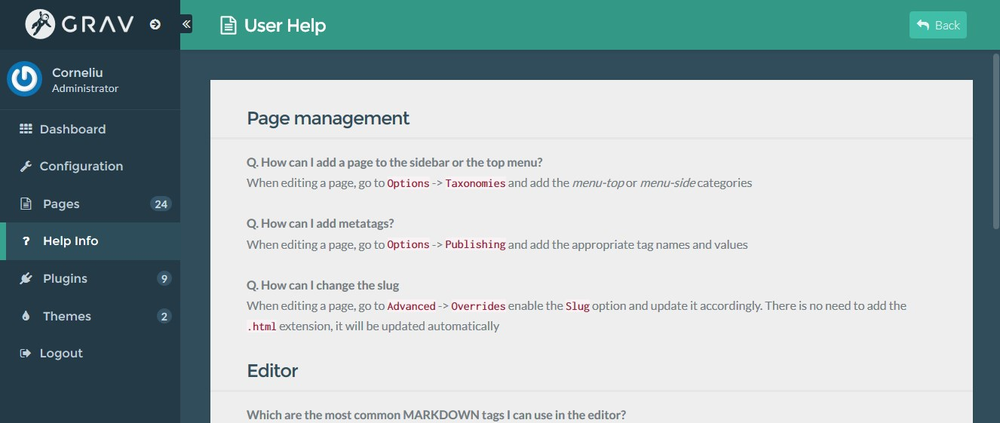

# User Help - Grav Plugin

A simple Grav CMS plugin which you can download and edit to provide an admin page containing various info for your 
clients or editors. 



### Installing

Download the package and move the contents inside the `user/plugins/userhelp/` directory of you Grav installation (you
must create it first).

Or, you can just run:

```
git clone https://github.com/Recon/grav-user-help-plugin.git user/plugins/userhelp
```

### Editing the help page

To customize the help page, update the userhelp/admin/templates/user-help.html.twig
